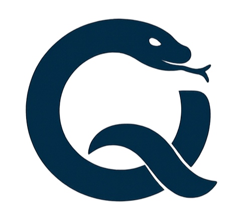

.. quazydb documentation master file, created by
   sphinx-quickstart on Tue Sep 16 15:44:01 2025.
   You can adapt this file completely to your liking, but it should at least
   contain the root `toctree` directive.

quazydb documentation
=====================

Powerful yet simple Python ORM
GitHub project: https://github.com/zergos/quazydb

.. toctree::
   :maxdepth: 3
   :caption: Contents:

   user_guide
   classes
   advanced
